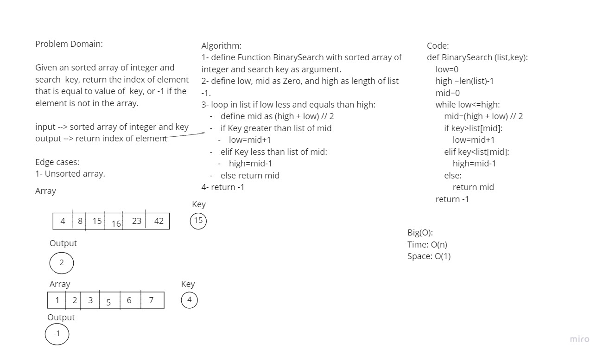

# Binary Search of Sorted Array
Given an sorted array of integer and search  key, return the index of element that is equal to value of  key, or -1 if the element is not in the array.

## Whiteboard Process

## Approach & Efficiency
Big(O):
Time: O(n)
Space: O(1)