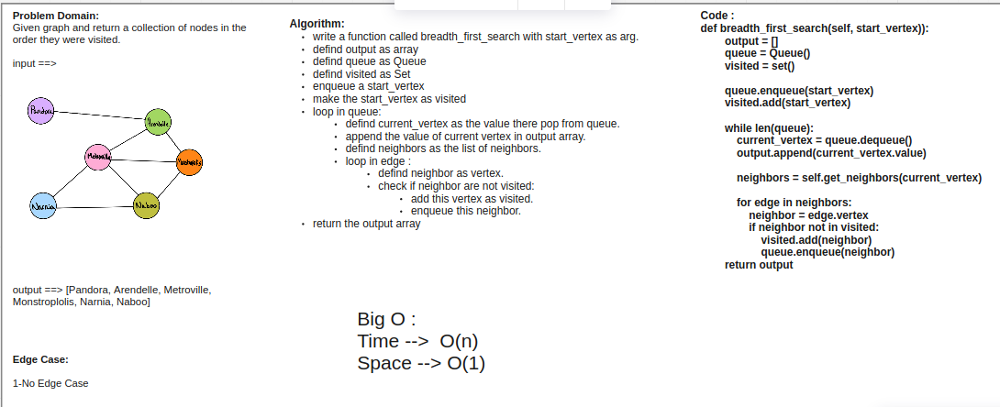

# Challenge Summary

In a `breadth first traversal`, you are starting at a specific vertex/node. This node must be specified when calling the BreadthFirst() method. The breadth-first traversal of a graph is like that of a tree, with the exception that graphs can have cycles. Traversing a graph that has cycles will result in an infinite loop….this is bad. To prevent such behavior, we need to have some way to keep track of whether a vertex has been “visited” before. Upon each visit, we’ll add the previously-unvisited vertex to a visited set, so we know not to visit it again as traversal continues.

As a refresher of what breadth first actually means here it is: Breadth first traversal is when you visit all the nodes that are closest to the root as possible. From there you traverse outwards, level by level, until you have visited all the vertices/nodes.

## Whiteboard Process

## Approach & Efficiency

Big O :

Time -->  O(n)

Space --> O(1)

## Solution

INPUT ==>

OUTPUT ==>

`graphs.breadth_first_search(vertex)`

`['Pandora', 'Arendelle', 'Metroville', 'Monstroplolis', 'Narnia', 'Naboo']`
