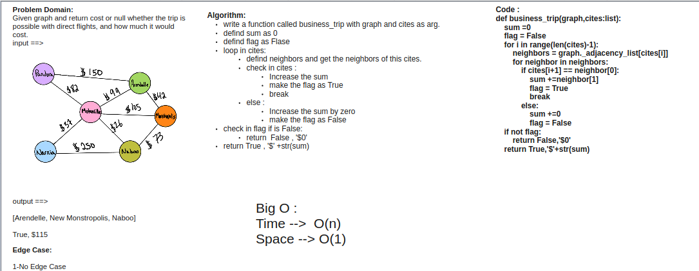

# Challenge Summary

Write a function called business trip

Arguments: graph, array of city names

Return: cost or null

Determine whether the trip is possible with direct flights, and how much it would cost.

## Whiteboard Process

## Approach & Efficiency

Big O :

Time -->  O(n)

Space --> O(1)

## Solution

INPUT ==>

OUTPUT ==>

`business_trip(graph,[Metroville, Pandora])`

`True, $82`
