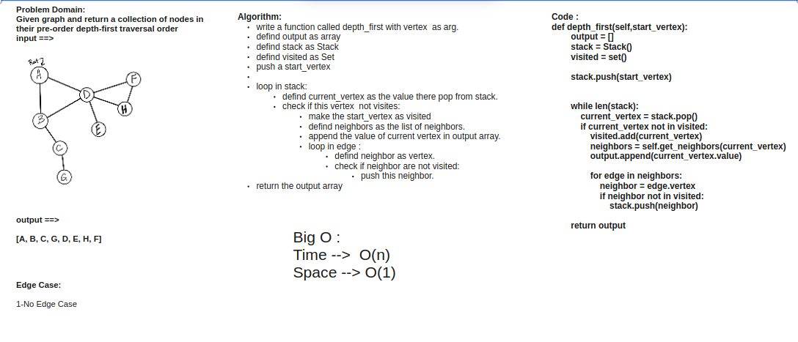

# Depth First Traversal

In a depth first traversal, we approach it a bit different than the way we do when working with a depth first traversal of a tree. Similar to how the breadth-first uses a queue, we are going to use a Stack for our depth-first traversal.

## Challenge Summary

Given graph and return a collection of nodes in their pre-order depth-first traversal order

## Approach & Efficiency

Big O :

Time -->  O(n)

Space --> O(1)

## Solution

