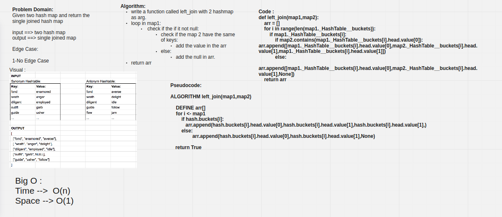

# Hashmap LEFT JOIN

Hash maps are indexed data structures. A hash map makes use of a hash function to compute an index with a key into an array of buckets or slots. Its value is mapped to the bucket with the corresponding index. The key is unique and immutable. Think of a hash map as a cabinet having drawers with labels for the things stored in them. For example, storing user information- consider email as the key, and we can map values corresponding to that user such as the first name, last name etc to a bucket.

## Challenge

Write a function that LEFT JOINs two hashmaps into a single data structure.

## Approach & Efficiency

Time: O(n)

Space: O(1)

## Solution

