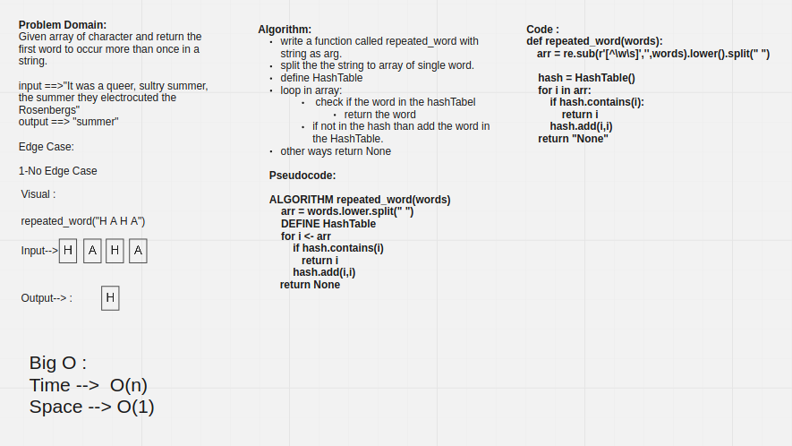

# Challenge Summary

Write a function called repeated word that finds the first word to occur more than once in a string.

## Whiteboard Process



## Approach & Efficiency

Time: O(n)

Space: O(1)

## Solution

```py
repeated = repeated_word("It was a queer, sultry summer, the summer they electrocuted the Rosenbergs, and I didn’t know what I was doing in New York...")

print(repeated)
```

```bash
summer
```

***

```py
repeated = repeated_word("Once upon a time, there was a brave princess who...")

print(repeated)
```

```bash
a
```
