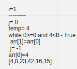
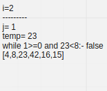
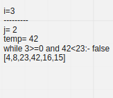
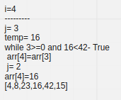

# Insertion Sort

Insertion sort is a simple sorting algorithm that works similar to the way you sort playing cards in your hands. The array is virtually split into a sorted and an unsorted part. Values from the unsorted part are picked and placed at the correct position in the sorted part.

## Trace

Sample Array: ```[8,4,23,42,16,15]```

**Pass 1**:



**Pass 1**:



**Pass 1**:



**Pass 4**:


