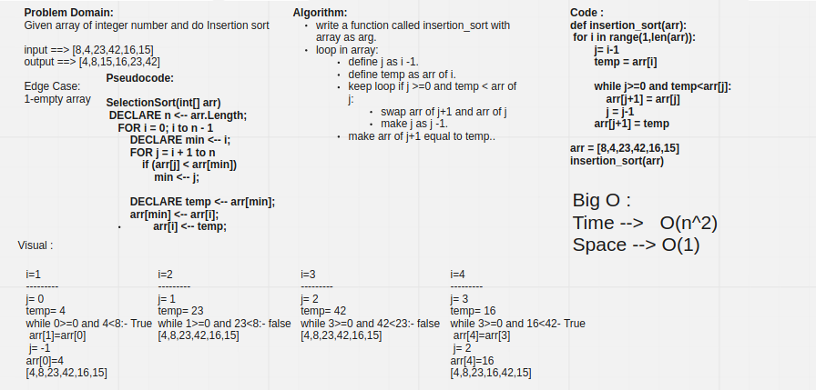

# Challenge Summary

Given array of integer number and do Insertion sort.

## Whiteboard Process



## Approach & Efficiency

Time: O(n^2)

Space: O(1)

## Solution

### **Input ==>**

```py
arr = [8,4,23,42,16,15]
insertion_sort(arr)
for i in range(len(arr)):
    print (arr[i])
```

### **Output ==>**

```bash
4
8
15
16
23
42
```
