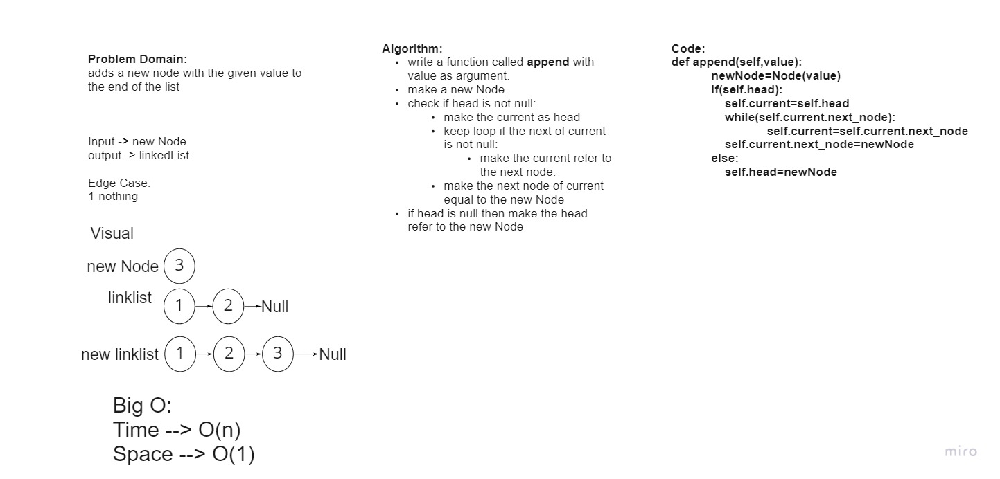

# Challenge Summary
append
arguments: new value
adds a new node with the given value to the end of the list

## Whiteboard Process

## Approach & Efficiency
Big O:

Time --> O(n) 

Space --> O(1)

## Solution
Initial List:
head -> [1] -> [3] -> [2] -> X

Method Args: 5	

Resulting List: 
head -> [1] -> [3] -> [2] -> [5] -> X