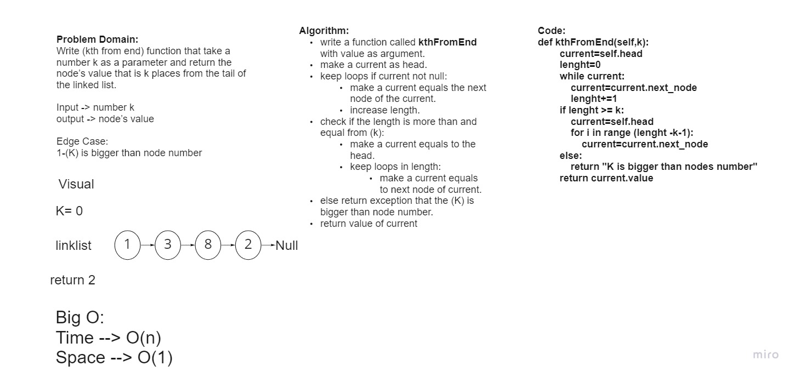

# Challenge Summary
Write kth from end function:

argument: a number, k, as a parameter.

Return the node’s value that is k places from the tail of the linked list.

You have access to the Node class and all the properties on the Linked List class as well as the methods created in previous challenges.

## Whiteboard Process

## Approach & Efficiency
Big O:

Time --> O(n) 

Space --> O(1)

## Solution
Input ll :
head -> [1] -> [3] -> [8] -> [2] -> X	

Arg k : 0	

Output : 2
****
Input ll :
head -> [1] -> [3] -> [8] -> [2] -> X	

Arg k : 6	

Output : Exception

		