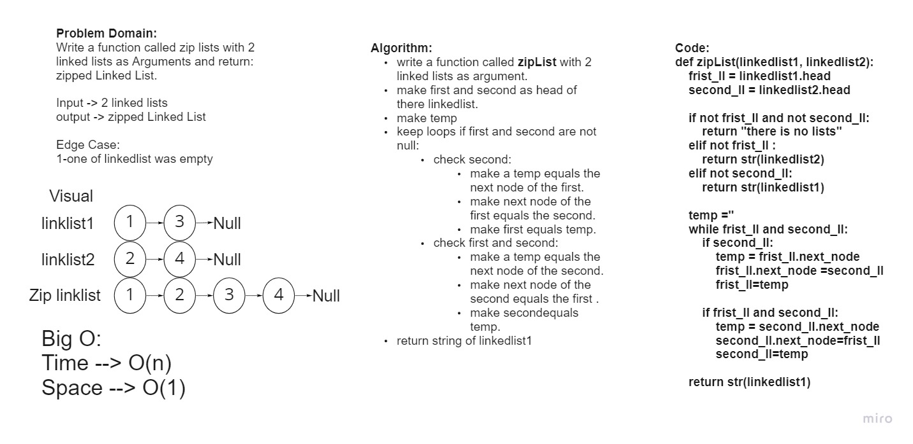

# Challenge Summary
Write a function called zip lists with 2 linked lists as Arguments and return: zipped Linked List.


## Whiteboard Process


## Approach & Efficiency
Big O:

Time --> O(n) 

Space --> O(1)

## Solution
```bash
zipLists(list1, list2)
```

Arg list1 : head -> [1] -> [3] -> [2] -> X	

Arg list2 : head -> [5] -> [9] -> [4] -> X

Output : head -> [1] -> [5] -> [3] -> [9] -> [2] -> [4] -> X

		
		