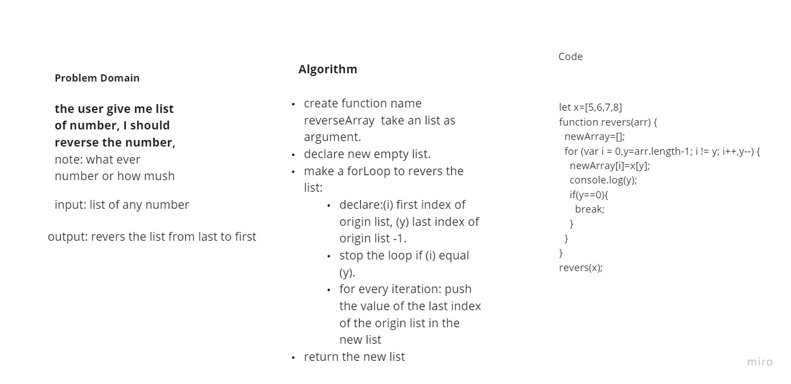

# Reverse an Array
The user give me list of number, I should reverse the number,
Note: what ever numbers or how mush.
input: list of numbers.
output: revers the numbers in list from last to first

## Whiteboard Process

<!-- ## Approach & Efficiency
What approach did you take? Discuss Why. What is the Big O space/time for this approach? -->
