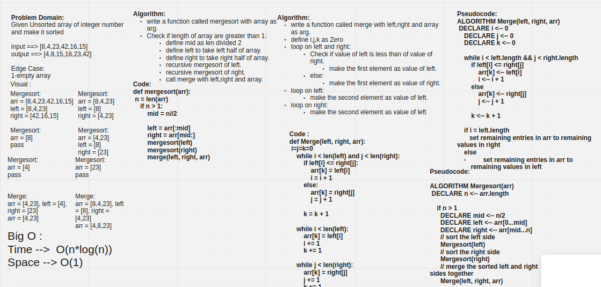

# Challenge Summary

merge two sorted array

## Whiteboard Process



## Approach & Efficiency

Time: O(n*log(n))

Space: O(1)

## Solution

INPUT==>

```py
arr = [8,4,23,42,16,15]

Mergesort(arr)
print("\n\nSorted array is")
for i in range(n):
    print("%d" % arr[i]),
```

OUTPUT ==>

```bash
Sorted array is
4
8
15
16
23
42
```
