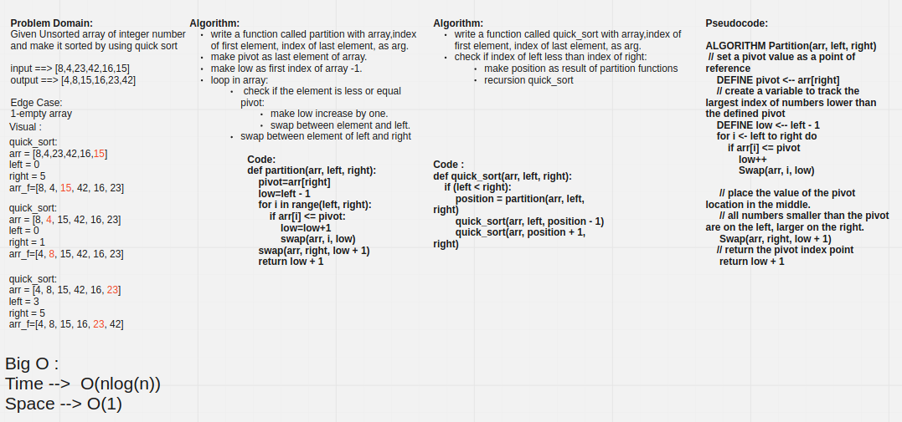

# Challenge Summary

Given Unsorted array of integer number
and make it sorted by using quick sort

## Whiteboard Process



## Approach & Efficiency

Time: O(nlog(n))

Space: O(1)

## Solution

INPUT==>

```py

array = [8,4,23,42,16,15]
quick_sort(array , 0 , len(array) - 1)

print(f'Sorted array: {array}')

```

OUTPUT ==>

```bash
Sorted array: [4, 8, 15, 16, 23, 42]
```
