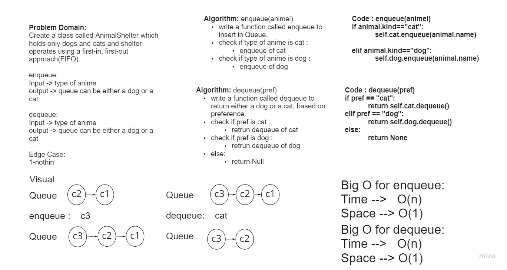

# stack-queue-animal-shelter
Create a class called AnimalShelter which holds only dogs and cats.
The shelter operates using a first-in, first-out approach.


## Challenge
Implement a AnimalShelter by using 2 Queue as first-in, first-out approach

## Whiteboard Process


## Approach & Efficiency
Big(O):

Time --> O(n)

Space --> O(1)


## API
AnimalShelter  :
-   **enqueue: Arguments: animal**
animal can be either a dog or a cat object.
-   **dequeue: Arguments: pref**
Return: either a dog or a cat, based on preference.
If pref is not "dog" or "cat" then return null.


## Solution
```bash
enqueue(animal)
```

Input : [cat2]->[cat1]	

Arg : "cat3"

Output : [cat3]->[cat2]->[cat1]

***
```bash
dequeue(pref)
```

Input : [cat3]->[cat2]->[cat1]	

Arg : "cat"

Output : [cat3]->[cat2]
