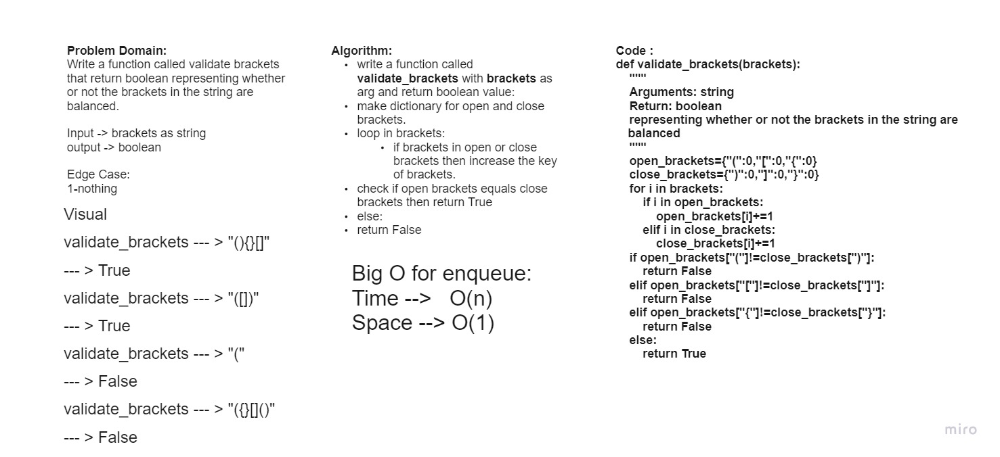

# stack-queue-brackets
## Challenge
Write a function called validate brackets that return boolean representing whether or not the brackets in the string are balanced.

## Whiteboard Process


## Approach & Efficiency
Big(O):

Time --> O(n)

Space --> O(1)


## API
**validate_brackets: Arguments: brackets**
Return: boolean
representing whether or not the brackets in the string are balanced

## Solution
```bash
validate_brackets(brackets)
```
Arg : "{}"

Output : True

Arg : "()[[Extra Characters]]"

Output : True

Arg : "(){}[[]]"

Output : True

Arg : "{"

Output : False

Arg : "()[["

Output : False
