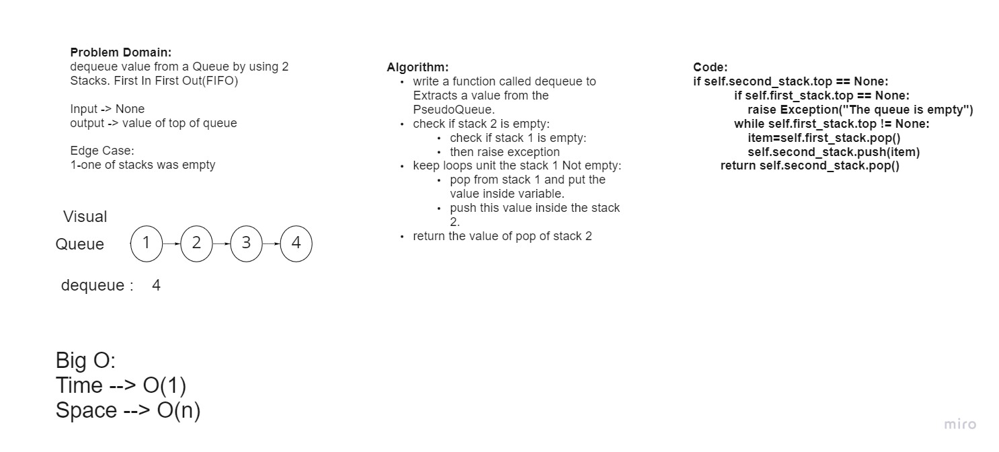

# pseudo queue
This PseudoQueue class will implement our standard queue interface (the two methods listed below),

Internally, utilize 2 Stack instances to create and manage the queue


## Challenge
Implement a Queue by using 2 Stacks

## Whiteboard Process


## Approach & Efficiency
Big(O):

Time --> O(1)

Space --> O(n)


## API
PseudoQueue :
-   **enqueue:**
Inserts value into the PseudoQueue, using a first-in, first-out approach.
-   **dequeue:**
Extracts a value from the PseudoQueue, using a first-in, first-out approach.

## Solution
```bash
enqueue(value)
```

Input : [10]->[15]->[20]	

Arg : 5

Output : [5]->[10]->[15]->[20]

***
```bash
dequeue()
```

Input : [5]->[10]->[15]->[20]	

Arg : 20

Output : [5]->[10]->[15]
