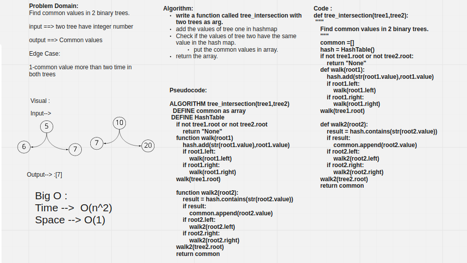

# Challenge Summary

Find common values in 2 binary trees.

## Whiteboard Process



## Approach & Efficiency

Time: O(n)

Space: O(1)

## Solution

```py
tree1 = Binary_Tree()
a_node = Node(1)
b_node = Node(2)
c_node = Node(3)
d_node = Node(4)
a_node.left = b_node
a_node.right = c_node
b_node.left = d_node

tree1.root=a_node
tree1.in_order()
# --------------------
tree2 = Binary_Tree()
a_node = Node(5)
b_node = Node(3)
c_node = Node(9)
d_node = Node(2)
a_node.left = b_node
a_node.right = c_node
b_node.left = d_node

tree2.root=a_node
tree2.in_order()

print(tree_intersection(tree1,tree2))
```

```bash
[2,3]
```

***

```py
repeated = repeated_word("Once upon a time, there was a brave princess who...")

print(repeated)
```

```bash
a
```
