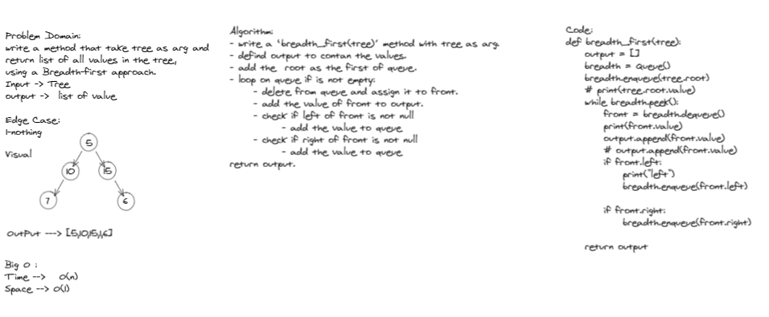

# Challenge Summary
return list of all values in the tree using a Breadth-first approach.

## Whiteboard Process

## Approach & Efficiency
Big O :

Time -->   O(n) 

Space --> O(1)

## Solution
breadth_first(tree)

input --->  2
           / \
          4   5

output ---> [2,4,5]
<!-- ////////////////// -->
input ---> -20
           / \
        -4    -5

output ---> [-20,-4,-5]

