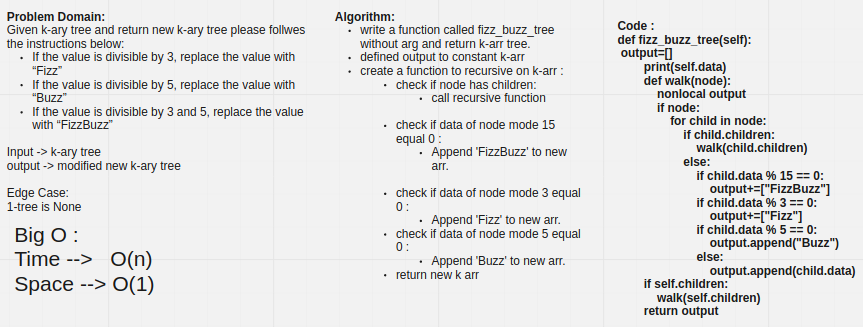

# Challenge Summary

Create a new tree with the same structure as the original, but the values modified as follows:

If the value is divisible by 3, replace the value with “Fizz”

If the value is divisible by 5, replace the value with “Buzz”

If the value is divisible by 3 and 5, replace the value with “FizzBuzz”

If the value is not divisible by 3 or 5, simply turn the number into a String.

return new k-ary tree

## Whiteboard Process

## Approach & Efficiency

Big O :

Time -->   O(n)

Space --> O(1)

## Solution

fizz_buzz_tree(tree)

input --->  57
           / \
          2   57
        /
       25

output ---> ['Fizz', 'Buzz', 'Fizz']
