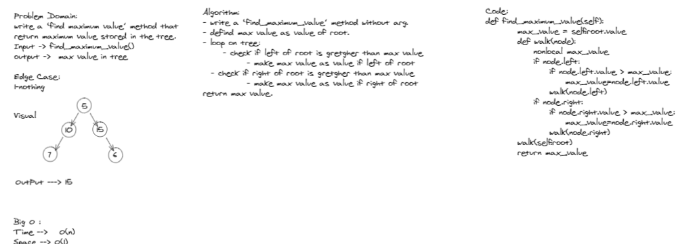

# Challenge Summary
return maximum value stored in the tree.

## Whiteboard Process

## Approach & Efficiency
Big O :

Time -->   O(n) 

Space --> O(1)

## Solution
find_maximum_value()

input --->  2
           / \
          4   5

output ---> 5
<!-- ////////////////// -->
input ---> -20
           / \
        -4    -5

output ---> -4